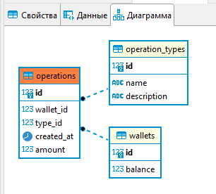

<h1>final-project</h1>
<h2>Начало работы</h2>
<li>Запустить dump-файл на своей локальной postgres БД</li>
<li>Изменить креды подключения к БД в файле <b>resources/hibernate.cfg.xml</b></li>
<li>Запустить файл <b>Main.java</b> для проверки методов</li>

<h2>API</h2>
<li>Запустить сервис с конфигурацией Tomcat</li>
<li>Выполнить GET запрос <i>/balance/getBalance/{userId}</i></li>
<li>Выполнить GET запрос <i>/balance/putMoney/{userId}/{amount}</i></li>
<li>Выполнить GET запрос <i>/balance/takeMoney/{userId}/{amount}</i></li>
<li>Выполнить GET запрос <i>/balance/takeMoney/{userId}/{amount}</i></li>
<li>Выполнить GET запрос <i>/balance/transferMoney/{senderId}/{recipientId}/{amount}</i></li>

<h2>ER</h2>
